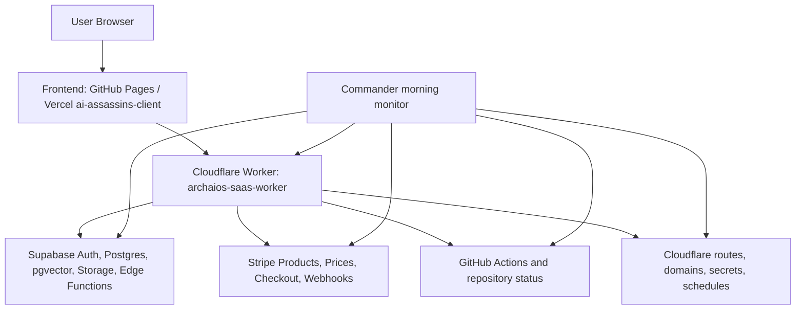

# Operation Skybridge Infrastructure Map

Date: 2026-07-02

Mission constraint: no code redesign, no new features, no deployment. This map records inspected production infrastructure and the exact external blockers preventing ARCHAIOS from going live.

## Verified Sources

- Local Git repository at `/Users/quandrixblackburn/Library/Mobile Documents/com~apple~CloudDocs/QX Technology 2019`
- `wrangler.toml`
- `client/wrangler.jsonc`
- `archaios-agents/wrangler.toml`
- `Archaios OS/cloudflare_worker/wrangler.toml`
- GitHub Actions workflow files under `.github/workflows/`
- Supabase SQL migrations under `client/supabase/sql/`
- Supabase Edge Functions under `supabase/functions/`
- Live Cloudflare health endpoint: `https://archaios-saas-worker.quandrix357.workers.dev/api/health`
- Live Cloudflare pricing endpoint: `https://archaios-saas-worker.quandrix357.workers.dev/api/pricing`
- Vercel project metadata for `ai-assassins-client`
- GitHub Actions run history for `saintblack-ai/archaios-system`

## Cloudflare Deployment Map

| Worker | Local Config | Entry Point | Purpose | Schedule | Local Bindings | Live Verification |
| --- | --- | --- | --- | --- | --- | --- |
| `archaios-saas-worker` | `wrangler.toml` | `worker.js` | Canonical SaaS backend API | `0 7 * * *` | Plain vars: `OPENAI_MODEL`, `LOCAL_TIMEZONE`, `WORKER_BASE_URL`, `FRONTEND_URL`, `WORKER_RELEASE`. Required secrets listed in comments: `OPENAI_API_KEY`, `SUPABASE_URL`, `SUPABASE_SERVICE_ROLE_KEY`, `AUTH_TOKEN`, `STRIPE_SECRET_KEY`, `STRIPE_WEBHOOK_SECRET`. | Dry-run deploy previously succeeded. Live endpoint does not currently serve this implementation. |
| `archaios-saas-worker` | `client/wrangler.jsonc` | `worker/index.js` | Daily automation, billing, dashboard signal Worker | `17 13 * * *` | Plain vars include `BACKEND_BASE_URL`, `WORKER_RELEASE`, cron endpoint paths, table names, and `SUPABASE_URL=https://pedymtymubpirhaikymj.supabase.co`. Required secrets listed in comments: `ADMIN_EMAIL`, `STRIPE_SECRET_KEY`, `STRIPE_PRICE_PRO`, `STRIPE_PRICE_ELITE`, `STRIPE_WEBHOOK_SECRET`, `SUPABASE_SERVICE_ROLE_KEY`, optional `CRON_AUTH_TOKEN`. | Live `/api/health` response matches this Worker family, not the canonical root Worker. |
| `archaios-agents` | `archaios-agents/wrangler.toml` | `src/index.ts` | Agent runtime Worker | Multiple cron triggers | No KV, D1, R2, or Durable Object bindings found in local config. | Live account state not verified because Wrangler auth is expired/non-interactive. |
| `archaios-daily-trigger` | `Archaios OS/cloudflare_worker/wrangler.toml` | `worker.js` | Legacy daily trigger | `0 5 * * *` | Plain var `ARCHAIOS_ENDPOINT=https://example.com/api/archaios/daily`; required secret `ARCHAIOS_TOKEN`. | Legacy/local only from repository inspection; live account state not verified. |

## Cloudflare Bindings

No KV, D1, R2, or Durable Object bindings are declared in the inspected local Worker configs. Account-level inventory still must be confirmed after Wrangler auth is restored.

Required Cloudflare inventory checks:

- Worker list
- Worker routes
- Worker custom domains
- Worker environment variables
- Worker secrets
- KV namespaces
- D1 databases
- R2 buckets
- Durable Object bindings
- Deployment history for `archaios-saas-worker`

## Public Endpoint Mismatch

Expected production backend:

- `https://archaios-saas-worker.quandrix357.workers.dev`
- Expected service identity: `archaios-saas-worker`
- Expected deployment source: root `wrangler.toml` and root `worker.js`

Observed live endpoint:

- `GET /api/health` returns HTTP 200
- Response body reports `service: "archaios-daily-automation"`
- Response body includes daily automation fields: `backendBaseUrlConfigured`, `adminEmailConfigured`, cron `17 13 * * *`, and job names `dashboard-signals`, `activity-feed`, `metrics-snapshots`
- `GET /api/pricing` returns active Free, Pro, and Elite pricing

Finding:

The public endpoint is serving the client daily automation Worker artifact, not the canonical root SaaS Worker. The local repository contains two deployable Worker configs using the same Worker name, `archaios-saas-worker`: root `wrangler.toml` and `client/wrangler.jsonc`. The live health payload matches the client Worker implementation shape. This is a deployment-source collision plus stale deployment artifact until Cloudflare deployment history proves otherwise.

Most likely cause:

The Worker name `archaios-saas-worker` was last deployed from `client/wrangler.jsonc`, so the public `workers.dev` endpoint is bound to the daily automation build. The account could also contain stale routes or custom domains, but local config does not define routes or custom domains. Route and custom-domain state must be verified in Cloudflare after authentication is restored.

## Supabase Map

Configured project URL found in active Worker config:

- `https://pedymtymubpirhaikymj.supabase.co`
- Source: `client/wrangler.jsonc`

Live DNS result:

- `pedymtymubpirhaikymj.supabase.co` fails DNS resolution with `ENOTFOUND`
- `GET https://pedymtymubpirhaikymj.supabase.co/auth/v1/health` fails because the host cannot be resolved

Local Supabase assets:

- SQL migrations exist under `client/supabase/sql/`
- Core production tables are represented locally: `profiles`, `subscriptions`, `alerts`, `leads`, `cta_events`, `revenue_events`
- Cron and dashboard tables are represented locally: `cron_job_runs`, `dashboard_signal_runs`, `activity_feed_runs`, `metrics_snapshots`
- Semantic memory migration exists and enables `vector`
- pgvector schema includes `embedding vector(1536)`
- Retrieval RPC exists locally as `public.match_archaios_memory_chunks`
- Edge Functions exist locally:
  - `supabase/functions/agent-orchestrator/index.ts`
  - `supabase/functions/stripe-webhook/index.ts`

Finding:

The configured production Supabase project host is not resolvable from DNS. That means the configured project either does not exist, was deleted, is in a different environment, or the project reference is wrong. Live Auth, database, storage, edge functions, migrations, and pgvector cannot be verified against this configured URL until the correct project ref is provided.

Origin of incorrect value:

- Current executable source: `client/wrangler.jsonc`
- Prior project reconstruction evidence: `SUPABASE_RECONSTRUCTION_REPORT.md` and `ARCHAIOS_ASSET_REGISTER.md` identify `pedymtymubpirhaikymj` as an original/unreachable Supabase project ref

## Stripe Map

Local billing implementation surfaces:

- Root Worker checkout and webhook paths
- Client Worker checkout, pricing, dashboard metrics, and webhook paths
- Server Stripe helper code
- Supabase Stripe webhook Edge Function

Required Stripe events are implemented in inspected code paths:

- `checkout.session.completed`
- `customer.subscription.created`
- `customer.subscription.updated`
- `customer.subscription.deleted`
- `invoice.payment_failed`

Additional supported event observed:

- `invoice.paid`

Local environment state:

- `STRIPE_SECRET_KEY` absent from local shell
- `STRIPE_WEBHOOK_SECRET` absent from local shell
- `STRIPE_PRICE_PRO` absent from local shell
- `STRIPE_PRICE_ELITE` absent from local shell

Finding:

Stripe code paths exist, but live products, prices, subscriptions, webhooks, and dashboard metrics cannot be verified without authenticated Stripe account access. No secrets were exposed during inspection.

## GitHub Map

Repository inspected:

- `saintblack-ai/archaios-system`

Relevant workflows:

- `.github/workflows/deploy.yml`
  - Deploys the Vite frontend from `client/` to GitHub Pages
  - Requires `VITE_BACKEND_URL`, `VITE_SUPABASE_URL`, and `VITE_SUPABASE_ANON_KEY`
- `.github/workflows/worker_heartbeat.yml`
  - Checks the public Worker health endpoint
  - Hardened to fail if `body.service !== "archaios-saas-worker"`

Finding:

Recent visible GitHub Worker Heartbeat runs were green before the hardened identity check was committed. A new run against the hardened workflow is required to prove the public endpoint now reports the canonical service identity.

## Vercel Map

Linked Vercel project:

- Project name: `ai-assassins-client`
- Project ID: `prj_O4pTRDr5EglSjPNzMVyOzF4icY7B`
- Team: `saintblack-ai's projects`
- Team slug: `saintblack-ais-projects`
- Team ID: `team_1X955N2NaejVA7KZC2thJ3ja`

Latest verified Vercel deployment:

- Target: production
- State: READY
- Runtime errors in last 7 days: none found
- GitHub source repository: `saintblack-ai/ai-assassins-client`

Finding:

Vercel production is healthy, but it deploys from a separate GitHub repository, `saintblack-ai/ai-assassins-client`, while this audit is operating in `saintblack-ai/archaios-system`. Production readiness depends on coordinating environment variables and release state across both repositories.

## Infrastructure Dependency Graph

## Missing Configuration Checklist

Cloudflare:

- Restore Wrangler authentication with a scoped `CLOUDFLARE_API_TOKEN` or interactive login
- Confirm deployment history for `archaios-saas-worker`
- Confirm routes and custom domains
- Confirm secrets on the production Worker
- Deploy canonical root Worker from root `wrangler.toml`
- Verify `/api/health` reports `service: "archaios-saas-worker"`

Supabase:

- Replace unreachable project ref `pedymtymubpirhaikymj` if it is not the live project
- Confirm Auth health
- Confirm service-role secret on Cloudflare
- Confirm anon key in frontend production environment
- Confirm migrations are applied
- Confirm pgvector extension and retrieval RPC
- Confirm Edge Functions deployed
- Confirm Storage buckets if production uses file ingestion

Stripe:

- Confirm production products exist for Pro and Elite
- Confirm production prices match `STRIPE_PRICE_PRO` and `STRIPE_PRICE_ELITE`
- Confirm webhook endpoint points to production backend `POST /api/stripe/webhook`
- Confirm required events are subscribed
- Confirm webhook signing secret is set on Cloudflare
- Confirm subscription sync updates Supabase and `profiles.tier`

GitHub/Vercel:

- Confirm GitHub Pages production env points to `https://archaios-saas-worker.quandrix357.workers.dev`
- Confirm Vercel env vars match the same backend and Supabase project
- Trigger hardened Worker Heartbeat after Cloudflare correction
- Keep rollback target for latest known READY Vercel deployment
