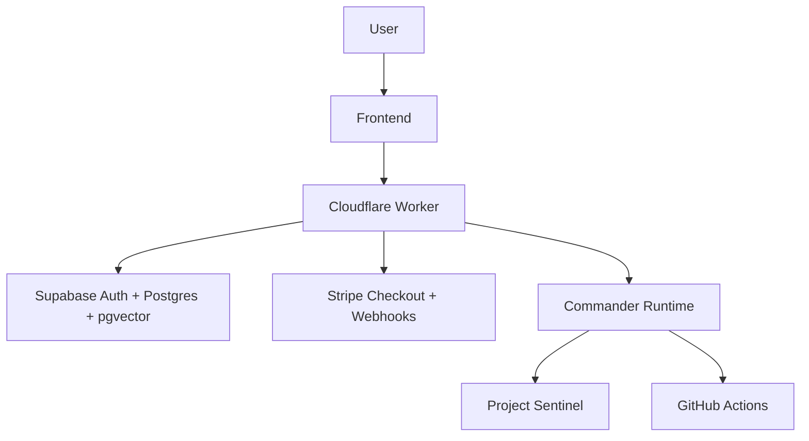

# Architecture Guide

**Audience:** Engineers, technical advisors, operators  
**Related:** [Admin Operations Guide](ADMIN_OPERATIONS_GUIDE.md), [Security Operations Manual](SECURITY_OPERATIONS_MANUAL.md), [Disaster Recovery Playbook](DISASTER_RECOVERY_PLAYBOOK.md)

## Executive Summary

ARCHAIOS is a modular AI operating system composed of a frontend application, Cloudflare Worker backend, Supabase data layer, Stripe billing, GitHub automation, and Commander-led operational intelligence. The current production concern is not architecture expansion; it is external infrastructure verification.

## System Layers

| Layer | Primary Technology | Responsibility |
| --- | --- | --- |
| Frontend | React, TypeScript, Tailwind, Next/Vite surfaces | User experience and dashboards |
| Backend | Cloudflare Workers, Node services, Python services | APIs, health, checkout, orchestration |
| Database | Supabase PostgreSQL, pgvector | Auth, subscriptions, memory, application state |
| Billing | Stripe | Products, prices, subscriptions, webhooks |
| Automation | GitHub Actions, Commander, Sentinel | Builds, checks, readiness, monitoring |
| Knowledge | Black Vault, Notion-ready Markdown | Mission memory and documentation |

## Infrastructure Flow



## Production Dependencies

| Dependency | Production Role | Current Status |
| --- | --- | --- |
| Cloudflare | Public backend Worker and health endpoint | Requires Worker identity correction |
| Supabase | Auth, database, pgvector, Edge Functions | Requires project ref verification |
| Stripe | Live billing and subscription sync | Requires live account verification |
| GitHub | Source control and heartbeat checks | Requires fresh heartbeat after backend correction |
| Vercel / GitHub Pages | Frontend hosting | Requires env alignment |

## Canonical Health Rule

A successful HTTP 200 is not enough. The backend health response must identify the canonical service:

```json
{
  "service": "archaios-saas-worker"
}
```

If the service identity differs, stop deployment and follow [Disaster Recovery Playbook](DISASTER_RECOVERY_PLAYBOOK.md).

## Engineering Boundaries

- Do not add new features while production readiness is blocked.
- Do not deploy from a dirty worktree.
- Do not store secrets in Git.
- Do not bypass Supabase Auth for protected routes.
- Do not change Stripe live objects without founder approval.
- Do not alter architecture to work around missing operator credentials.

## Documentation Links

- Founder context: [Founder Handbook](FOUNDER_HANDBOOK.md)
- Daily operations: [Daily Commander Operations Manual](DAILY_COMMANDER_OPERATIONS_MANUAL.md)
- Security controls: [Security Operations Manual](SECURITY_OPERATIONS_MANUAL.md)
- Recovery: [Disaster Recovery Playbook](DISASTER_RECOVERY_PLAYBOOK.md)
- Roadmap: [12-Month Product Roadmap](TWELVE_MONTH_PRODUCT_ROADMAP.md)
