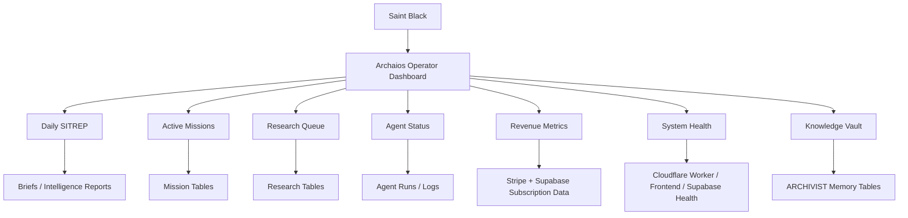

# Archaios Operator Dashboard Spec

Generated: 2026-06-19

Operator: Saint Black

Status: Documentation only. No implementation approved yet.

## Purpose

The Archaios Operator Dashboard is the command center for Saint Black to inspect daily intelligence, mission execution, research backlog, agent runtime status, revenue posture, system health, and the institutional memory vault.

The dashboard should be operational, not decorative. It should help the operator answer:

- What matters today?
- What missions are active?
- What research is waiting?
- Which agents are healthy?
- Is revenue moving?
- Is the system safe?
- What knowledge needs preservation or review?

## Primary Sections

1. Daily SITREP
2. Active Missions
3. Research Queue
4. Agent Status
5. Revenue Metrics
6. System Health
7. Knowledge Vault

## Information Architecture



## Dashboard Wireframes

### Main Operator View

```text
+--------------------------------------------------------------------------------+
| ARCHAIOS COMMAND CENTER                                      Operator: Saint Black |
+--------------------------------------------------------------------------------+
| Date / Time        | System Health: OK/Warn | Revenue: $MRR | Active Missions: # |
+--------------------------------------------------------------------------------+
| DAILY SITREP                                                                    |
| +-------------------------------+  +------------------------------------------+ |
| | Today's Brief                 |  | Priority Actions                         | |
| | - Summary                     |  | 1. Critical action                       | |
| | - Threats                     |  | 2. Revenue action                        | |
| | - Opportunities               |  | 3. Research action                       | |
| +-------------------------------+  +------------------------------------------+ |
+--------------------------------------------------------------------------------+
| ACTIVE MISSIONS                    | RESEARCH QUEUE                             |
| +--------------------------------+ | +-----------------------------------------+ |
| | Mission / Status / Owner       | | | Topic / Priority / Status              | |
| | Due / Next Action              | | | Evidence Needed / Assigned Agent       | |
| +--------------------------------+ | +-----------------------------------------+ |
+--------------------------------------------------------------------------------+
| AGENT STATUS                       | REVENUE METRICS                            |
| +--------------------------------+ | +-----------------------------------------+ |
| | ARCHIVIST: ready               | | | MRR / Subscribers / Leads / CTA         | |
| | Research Agent: queued         | | | Checkout Health / Failed Payments       | |
| | Mission Agent: running         | | +-----------------------------------------+ |
| +--------------------------------+ |                                             |
+--------------------------------------------------------------------------------+
| SYSTEM HEALTH                      | KNOWLEDGE VAULT                            |
| +--------------------------------+ | +-----------------------------------------+ |
| | Worker: online                 | | | New Items / Duplicates / Needs Review   | |
| | Supabase: online               | | | Top Concepts / Recent Summaries         | |
| | Stripe: configured?            | | +-----------------------------------------+ |
| +--------------------------------+ |                                             |
+--------------------------------------------------------------------------------+
```

### Daily SITREP Detail

```text
+--------------------------------------------------------------------------------+
| DAILY SITREP                                                                    |
+--------------------------------------------------------------------------------+
| Generated: 2026-06-19  | Source: Mission Agent / Research Agent / Manual        |
| Confidence: Medium     | Review Status: Needs Operator Review                   |
+--------------------------------------------------------------------------------+
| Executive Summary                                                               |
| Concise daily operational summary.                                               |
+--------------------------------------------------------------------------------+
| Signals                                                                          |
| - Revenue signal                                                                 |
| - Research signal                                                                |
| - System signal                                                                  |
+--------------------------------------------------------------------------------+
| Threats / Risks                                                                  |
| - Checkout not verified                                                          |
| - Duplicate knowledge records                                                    |
+--------------------------------------------------------------------------------+
| Recommended Actions                                                              |
| [Approve] [Assign Mission] [Archive] [Send To Research Queue]                    |
+--------------------------------------------------------------------------------+
```

### Active Missions Detail

```text
+--------------------------------------------------------------------------------+
| ACTIVE MISSIONS                                                                 |
+--------------------------------------------------------------------------------+
| Filters: [Critical] [Important] [Revenue] [Research] [Blocked] [Completed]       |
+--------------------------------------------------------------------------------+
| Mission Card                                                                     |
| Title: Verify Stripe checkout path                                               |
| Priority: Critical                                                               |
| Owner: Saint Black / Mission Agent                                               |
| Status: In Progress                                                              |
| Due: 2026-06-21                                                                  |
| Next Action: Run Pro test checkout and verify Supabase tier sync                 |
| Linked Research: Revenue Readiness Audit                                         |
| Linked Vault Items: Stripe setup docs, Supabase schema notes                     |
| Actions: [Update] [Complete] [Block] [Attach Evidence]                           |
+--------------------------------------------------------------------------------+
```

### Research Queue Detail

```text
+--------------------------------------------------------------------------------+
| RESEARCH QUEUE                                                                  |
+--------------------------------------------------------------------------------+
| Topic                          | Priority | Status       | Evidence Gap          |
| Stripe webhook hardening        | Critical | Needs Review | Test events required  |
| QX materials supply chain       | High     | Active       | Source validation     |
| Saint Black audience segments   | Medium   | Draft        | Market signal data    |
+--------------------------------------------------------------------------------+
| Actions: [Create Research Item] [Assign Agent] [Link Source] [Move To Vault]     |
+--------------------------------------------------------------------------------+
```

### Agent Status Detail

```text
+--------------------------------------------------------------------------------+
| AGENT STATUS                                                                    |
+--------------------------------------------------------------------------------+
| Agent       | Status  | Last Run            | Last Result | Next Action          |
| ARCHIVIST   | Ready   | 2026-06-19 09:12    | Success     | Review duplicates    |
| Research    | Queued  | 2026-06-19 08:20    | Warning     | Add sources          |
| Mission     | Running | 2026-06-19 09:30    | Pending     | Wait                 |
| Market      | Ready   | 2026-06-18 18:00    | Success     | Scan leads           |
| Builder     | Paused  | None                | Not started | Await approval       |
+--------------------------------------------------------------------------------+
| Actions: [Run Agent] [View Logs] [Pause] [Resume] [Open Output]                  |
+--------------------------------------------------------------------------------+
```

### Revenue Metrics Detail

```text
+--------------------------------------------------------------------------------+
| REVENUE METRICS                                                                 |
+--------------------------------------------------------------------------------+
| MRR       | Active Subs | Pro | Elite | Leads | CTA Clicks | Failed Payments    |
| $0 / live | 0           | 0   | 0     | 0     | 0          | 0                  |
+--------------------------------------------------------------------------------+
| Checkout Status                                                                 |
| Worker endpoint: /api/stripe/checkout                                            |
| Webhook endpoint: /api/stripe/webhook                                            |
| Stripe config: needs verification                                                |
| Supabase sync: needs verification                                                |
+--------------------------------------------------------------------------------+
| Actions: [Open Stripe Checklist] [Run Test Checkout] [View Revenue Events]       |
+--------------------------------------------------------------------------------+
```

### System Health Detail

```text
+--------------------------------------------------------------------------------+
| SYSTEM HEALTH                                                                   |
+--------------------------------------------------------------------------------+
| Service                 | Status | Last Checked        | Notes                  |
| GitHub Pages Frontend   | OK     | 2026-06-19 09:20    | 200                    |
| Cloudflare Worker       | Warn   | 2026-06-19 09:20    | Health payload mismatch|
| Supabase Auth           | Unknown| Pending             | Needs auth smoke test  |
| Supabase Database       | Unknown| Pending             | Schema verification    |
| Stripe                  | Unknown| Pending             | Test checkout required |
| OpenAI                  | OK     | Local env check     | Key present locally    |
+--------------------------------------------------------------------------------+
| Actions: [Run Health Check] [Open Deploy Notes] [Create Incident Mission]        |
+--------------------------------------------------------------------------------+
```

### Knowledge Vault Detail

```text
+--------------------------------------------------------------------------------+
| KNOWLEDGE VAULT                                                                 |
+--------------------------------------------------------------------------------+
| Total Items | New This Week | Duplicate Candidates | Needs Review | Concepts     |
| 0 / pending | 0             | 0                    | 0            | 0            |
+--------------------------------------------------------------------------------+
| Recent Memory Items                                                             |
| - ARCHIVIST approval document                                                    |
| - Phase II current state report                                                  |
| - Revenue readiness audit                                                        |
+--------------------------------------------------------------------------------+
| Top Concepts                                                                    |
| Archaios, QX Technology, AI Assassins, Saint Black Music, Truth Engine           |
+--------------------------------------------------------------------------------+
| Actions: [Add Memory] [Review Duplicates] [Open Concept Graph] [Export Vault]    |
+--------------------------------------------------------------------------------+
```

## Database Requirements

### Existing Tables To Use

The dashboard should consume these existing/planned data domains where available:

- `profiles`
- `subscriptions`
- `alerts`
- `leads`
- `cta_events`
- `revenue_events`
- `revenue_summary`
- `agents`
- `agent_runs`
- `agent_logs`
- `intelligence_reports`
- `content_drafts`
- `marketing_queue`
- `performance_metrics`
- `archivist_items`
- `archivist_concepts`
- `archivist_links`
- `archivist_duplicate_candidates`
- `archivist_summaries`

### New Tables Recommended

#### `operator_sitreps`

| Column | Type | Notes |
|---|---|---|
| `id` | uuid | Primary key |
| `sitrep_date` | date | Daily report date |
| `title` | text | SITREP title |
| `summary` | text | Executive summary |
| `signals` | jsonb | Revenue/research/system signals |
| `risks` | jsonb | Threats and blockers |
| `recommended_actions` | jsonb | Prioritized actions |
| `source_refs` | jsonb | Linked reports, agent runs, vault items |
| `confidence_level` | text | `low`, `medium`, `high` |
| `review_status` | text | `draft`, `needs_review`, `approved`, `archived` |
| `created_by` | text | Agent/user |
| `created_at` | timestamptz | Creation time |
| `updated_at` | timestamptz | Last update |

#### `operator_missions`

| Column | Type | Notes |
|---|---|---|
| `id` | uuid | Primary key |
| `title` | text | Mission title |
| `description` | text | Mission detail |
| `priority` | text | `critical`, `important`, `optional`, `future` |
| `status` | text | `queued`, `active`, `blocked`, `completed`, `archived` |
| `mission_type` | text | `revenue`, `research`, `system`, `content`, `legal`, `archive` |
| `owner` | text | Saint Black, agent name, or assignee |
| `due_at` | timestamptz | Optional |
| `next_action` | text | Immediate next move |
| `linked_research_ids` | uuid[] | Optional |
| `linked_vault_item_ids` | uuid[] | Optional |
| `created_at` | timestamptz | Creation time |
| `updated_at` | timestamptz | Last update |

#### `operator_research_queue`

| Column | Type | Notes |
|---|---|---|
| `id` | uuid | Primary key |
| `topic` | text | Research topic |
| `question` | text | Research question |
| `priority` | text | `critical`, `high`, `medium`, `low` |
| `status` | text | `queued`, `active`, `needs_sources`, `needs_review`, `complete`, `archived` |
| `evidence_gap` | text | Missing evidence or validation need |
| `assigned_agent` | text | Optional |
| `source_refs` | jsonb | Sources/files/URLs |
| `related_mission_id` | uuid | Optional |
| `created_at` | timestamptz | Creation time |
| `updated_at` | timestamptz | Last update |

#### `operator_health_checks`

| Column | Type | Notes |
|---|---|---|
| `id` | uuid | Primary key |
| `service_name` | text | Frontend, Worker, Supabase, Stripe, OpenAI |
| `service_url` | text | Optional |
| `status` | text | `ok`, `warn`, `error`, `unknown` |
| `status_code` | integer | Optional HTTP status |
| `message` | text | Human-readable note |
| `checked_at` | timestamptz | Check time |
| `metadata` | jsonb | Raw/sanitized health data |

### Required Indexes

- `operator_sitreps(sitrep_date desc)`
- `operator_missions(status, priority, due_at)`
- `operator_research_queue(status, priority, updated_at desc)`
- `operator_health_checks(service_name, checked_at desc)`
- Existing revenue tables indexed by `created_at`, `status`, and `user_id`.
- Archivist tables indexed by `category`, `status`, `updated_at`, and concept links.

## API Requirements

Recommended base path:

`/api/operator`

### Dashboard Aggregate

| Route | Method | Purpose |
|---|---|---|
| `/api/operator/dashboard` | GET | Single payload for main dashboard |

Response should include:

- latest SITREP
- active missions
- research queue preview
- agent status summary
- revenue summary
- system health summary
- knowledge vault summary

### SITREP Routes

| Route | Method | Purpose |
|---|---|---|
| `/api/operator/sitrep` | GET | List SITREPs |
| `/api/operator/sitrep` | POST | Create SITREP |
| `/api/operator/sitrep/:id` | GET | Detail |
| `/api/operator/sitrep/:id` | PATCH | Review/update |
| `/api/operator/sitrep/generate` | POST | Generate draft from current signals |

### Mission Routes

| Route | Method | Purpose |
|---|---|---|
| `/api/operator/missions` | GET | List missions |
| `/api/operator/missions` | POST | Create mission |
| `/api/operator/missions/:id` | GET | Detail |
| `/api/operator/missions/:id` | PATCH | Update status/next action |

### Research Queue Routes

| Route | Method | Purpose |
|---|---|---|
| `/api/operator/research-queue` | GET | List queued research |
| `/api/operator/research-queue` | POST | Create research queue item |
| `/api/operator/research-queue/:id` | PATCH | Update status/assignment |

### Agent Status Routes

| Route | Method | Purpose |
|---|---|---|
| `/api/operator/agents/status` | GET | Agent status summary |
| `/api/operator/agents/runs` | GET | Agent run history |
| `/api/operator/agents/run` | POST | Trigger approved agent run |

### Revenue Routes

| Route | Method | Purpose |
|---|---|---|
| `/api/operator/revenue` | GET | MRR, subscriptions, leads, CTA, webhook status |
| `/api/operator/revenue/events` | GET | Revenue event log |
| `/api/operator/revenue/checklist` | GET | Checkout readiness checklist |

### Health Routes

| Route | Method | Purpose |
|---|---|---|
| `/api/operator/health` | GET | Latest service health |
| `/api/operator/health/run` | POST | Run health checks |

### Knowledge Vault Routes

Use ARCHIVIST routes as canonical:

- `/api/archivist/items`
- `/api/archivist/concepts`
- `/api/archivist/duplicates`
- `/api/archivist/digest`

Operator dashboard may expose a summary endpoint:

| Route | Method | Purpose |
|---|---|---|
| `/api/operator/knowledge-vault` | GET | Archivist summary for command center |

## User Permissions

### Roles

| Role | Description |
|---|---|
| `operator` | Saint Black. Full dashboard control. |
| `admin` | Technical administrator. Full system access except private journal sections if restricted. |
| `agent` | Internal service actor. Can write logs/output through approved routes. |
| `viewer` | Read-only dashboard access. Optional future role. |
| `customer` | Paid/free external user. No operator dashboard access. |

### Saint Black Operator Permissions

Saint Black should be able to:

- View all dashboard sections.
- Generate and approve SITREPs.
- Create/update missions.
- Create/update research queue items.
- Trigger approved agent runs.
- View revenue metrics.
- Run health checks.
- Review knowledge vault entries.
- Resolve duplicate candidates.
- Export vault summaries.

Saint Black should not need direct access to raw secrets.

### Agent Permissions

Agents can:

- Create mission logs.
- Create research outputs.
- Create draft SITREPs.
- Write run logs.
- Suggest duplicate links.
- Suggest categories and summaries.

Agents cannot:

- Delete records.
- Mark a SITREP approved.
- Mark revenue as verified without evidence.
- Change billing configuration.
- Access private journal material unless explicitly scoped.

### Customer Permissions

Customers can:

- Access customer-facing dashboard features by tier.
- View their own subscription state.

Customers cannot:

- Access operator dashboard.
- View system health internals.
- View global revenue metrics.
- View institutional memory unless explicitly published.

## Access Control Rules

- Operator dashboard routes require Supabase auth plus operator/admin authorization.
- Internal agent writes require `AUTH_TOKEN` or a dedicated service token.
- All write actions should create audit logs.
- No destructive deletes in v1.
- Private journal and military history material must be segmented from general customer-facing knowledge.
- Revenue metrics should distinguish demo values from live Stripe/Supabase values.

## Dashboard Data Contract

`GET /api/operator/dashboard` should return:

```json
{
  "operator": "Saint Black",
  "generatedAt": "2026-06-19T00:00:00.000Z",
  "sitrep": {
    "title": "Daily SITREP",
    "summary": "...",
    "risks": [],
    "recommendedActions": []
  },
  "missions": {
    "activeCount": 0,
    "criticalCount": 0,
    "items": []
  },
  "researchQueue": {
    "queuedCount": 0,
    "needsReviewCount": 0,
    "items": []
  },
  "agents": {
    "healthyCount": 0,
    "warningCount": 0,
    "items": []
  },
  "revenue": {
    "mrr": 0,
    "activeSubscribers": 0,
    "leads": 0,
    "ctaClicks": 0,
    "failedPayments": 0,
    "source": "live"
  },
  "systemHealth": {
    "status": "unknown",
    "services": []
  },
  "knowledgeVault": {
    "totalItems": 0,
    "duplicateCandidates": 0,
    "needsReview": 0,
    "topConcepts": []
  }
}
```

## Implementation Sequence After Approval

1. Confirm dashboard lives in `client/` as `/operator` expansion or new `/command-center`.
2. Add database migration for operator tables.
3. Add protected Worker routes under `/api/operator`.
4. Add aggregate dashboard endpoint first.
5. Add UI skeleton with all seven sections.
6. Wire read-only live data.
7. Add mission/research/SITREP write actions.
8. Add agent trigger actions after audit logging is in place.
9. Add knowledge vault integration through ARCHIVIST endpoints.
10. Add export/report generation.

## Approval Checklist

Before building, approve:

- Route base: `/api/operator`.
- UI path: `/operator`, `/command-center`, or inside existing Archaios Command Center.
- New table names.
- Role model.
- Whether private journals and military history appear in the same vault or require separate locked partitions.
- Whether revenue section should show only live data or allow clearly labeled demo projections.

## Recommended V1

- Operator-only.
- Read-heavy first.
- No deletes.
- Live revenue only, with demo values clearly blocked from production metrics.
- Knowledge Vault summary pulls from ARCHIVIST once approved.
- Agent triggers require confirmation and audit logs.
