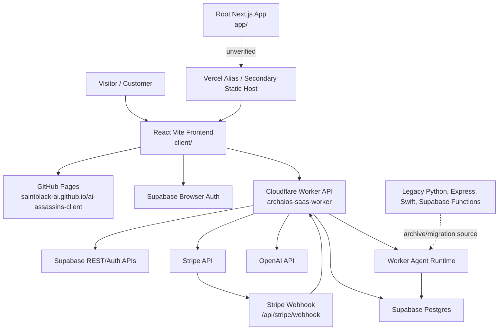
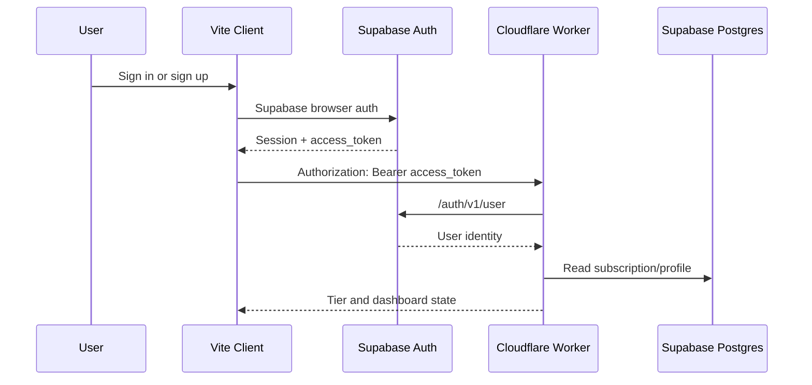
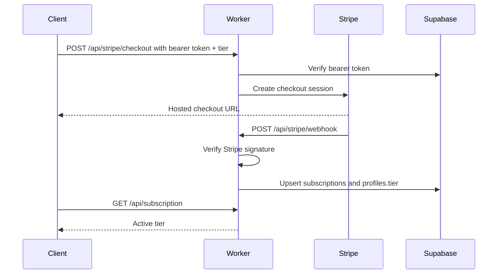

# Archaios Phase II Architecture Map

Generated: 2026-06-19

## System Overview

## Frontend

Primary implementation:

- Path: `client/`
- Framework: React 18 + Vite
- Build command: `npm --prefix client run build`
- Deployment: GitHub Pages workflow in `.github/workflows/deploy.yml`
- Runtime env style: `import.meta.env`
- Canonical production backend config: `VITE_BACKEND_URL=https://archaios-saas-worker.quandrix357.workers.dev`

Key files:

- `client/src/App.jsx`
- `client/src/lib/platform.js`
- `client/src/lib/supabase.js`
- `client/src/agents/stripeAgent.js`
- `client/src/pages/revenue/PricingPage.jsx`
- `client/src/pages/Dashboard.jsx`
- `client/src/pages/archaios/ArchaiosCommandCenter.tsx`

Responsibilities:

- Public landing/pricing/dashboard shell.
- Supabase sign-in/sign-up/session handling.
- Signed-out checkout blocking.
- Checkout intent preservation in local storage.
- Tier-aware dashboard locks.
- Calls Worker APIs with Supabase bearer tokens.

## Backend

Primary implementation:

- Path: root `worker.js`
- Runtime: Cloudflare Workers
- Config: root `wrangler.toml`
- Deploy command: `npx wrangler deploy --name archaios-saas-worker`

Primary API routes:

| Route | Method | Purpose |
|---|---|---|
| `/api/health` | GET | Public health |
| `/api/pricing` | GET | Tier data |
| `/api/subscription` | GET | Authenticated subscription state |
| `/api/alerts` | GET/DELETE | Authenticated alert read/clear |
| `/api/stripe/checkout` | POST | Authenticated Stripe checkout start |
| `/api/stripe/webhook` | POST | Stripe subscription sync |
| `/api/leads` | POST | Email lead capture |
| `/api/cta-click` | POST | CTA analytics |
| `/api/platform/dashboard` | GET | Dashboard payload |
| `/api/admin/dashboard` | GET | Admin summary |
| `/api/agents/*` | GET/POST | Agent execution/status/log APIs |
| `/api/marketing/*` | GET/POST | Marketing draft and approval APIs |

## Database

Primary database: Supabase Postgres.

Core tables:

- `profiles`
- `subscriptions`
- `alerts`
- `leads`
- `cta_events`
- `revenue_events`
- `revenue_summary`
- `briefs`
- `agent_logs`
- `agent_runs`
- `agents`
- `intelligence_reports`
- `content_drafts`
- `marketing_queue`
- `marketing_schedule`
- `performance_metrics`
- `sales_content`

Critical constraints:

- `profiles.id` references `auth.users(id)`.
- `subscriptions.user_id` should be unique for Worker `on_conflict=user_id` upsert.
- `subscriptions.stripe_subscription_id` should be unique when present.
- `profiles.tier` and `subscriptions.tier` must stay in `free`, `pro`, `elite`.

## Authentication

Rules:

- Frontend uses Supabase browser auth only.
- Backend protected routes expect a Supabase bearer token.
- Signed-out users can view the dashboard shell.
- Signed-out users must not start paid checkout.

## Payments

Paid plans:

- `pro`: `$49/month`
- `elite`: `$99/month`

Required Stripe env:

- `STRIPE_SECRET_KEY`
- `STRIPE_WEBHOOK_SECRET`
- `STRIPE_PRICE_PRO`
- `STRIPE_PRICE_ELITE`

## AI Services

Current AI integration:

- Worker calls OpenAI for briefs, market intelligence, marketing plans, content drafts, optimization feedback, and agent outputs.
- Default model in config: `gpt-4o-mini`.
- Required secret: `OPENAI_API_KEY`.

AI-dependent Worker functions include:

- Intelligence brief generation.
- Market intel generation.
- Content draft generation.
- Marketing plan/draft generation.
- Revenue sentinel summaries.
- System sentinel summaries.

## Cloudflare Workers

Canonical Worker:

- `worker.js`
- `wrangler.toml`
- `name = "archaios-saas-worker"`
- Cron in local config: `0 7 * * *`

Observed production health on 2026-06-19:

- `/api/health` returns 200.
- Response body identifies `archaios-daily-automation` and cron `17 13 * * *`, which does not match local `worker.js`. Deployment identity must be reconciled.

Other Worker-like code:

- `client/worker/index.js`
- `archaios/worker/worker.js`
- `archaios-agents/src/index.ts`
- `Archaios OS/cloudflare_worker/worker.js`

## Supabase

Used for:

- Browser auth.
- User profile tier state.
- Subscription state.
- Alerts.
- Leads and CTA analytics.
- Agent logs/runs.
- Marketing/content storage.
- Revenue event summaries.

Launch dependency:

- Production Supabase schema must be verified against the Worker code, not just assumed from migrations.

## Stripe

Used for:

- Hosted subscription checkout.
- Subscription lifecycle webhooks.
- Customer/subscription IDs stored in Supabase.

Launch dependency:

- Test-mode and live-mode prices must map exactly to `pro` and `elite`.
- Webhook endpoint must point to the deployed Worker.
- Webhook signing secret must match the Worker secret.

## Vercel

Current role:

- Secondary static deployment exists at `https://ai-assassins-client.vercel.app/`.
- Prior docs called Vercel primary, but current AGENTS.md says GitHub Pages is the frontend host.
- Root Next.js app exists and appears intended for Vercel, but root `next build` was not verified in this audit.

Recommendation:

- Treat Vercel as secondary until a deliberate hosting decision is made.
- If Vercel becomes primary again, consolidate env, routing, and deployment docs around that choice.

## Major Architecture Risk

The largest system risk is not one missing feature. It is split-brain runtime ownership:

- GitHub Pages Vite client is canonical now.
- Vercel static alias is still live.
- Root Next app contains overlapping API and Stripe code.
- Express, Python, Supabase functions, and multiple Workers duplicate parts of the platform.

Phase II should freeze the canonical revenue path as:

`client/` -> GitHub Pages -> root Cloudflare `worker.js` -> Supabase + Stripe + OpenAI.
