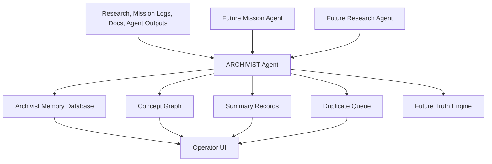

# ARCHIVIST Agent Approval Document

Generated: 2026-06-19

## Approval Scope

This document defines the first operational Archaios AI agent: `ARCHIVIST`.

No code, database migration, API route, or UI component should be built until this document is approved.

## Agent Identity

Agent name: `ARCHIVIST`

Primary purpose:

Maintain institutional memory for Archaios by preserving research, mission logs, decisions, summaries, source context, and relationships between ideas.

Core principle:

ARCHIVIST does not decide truth. It preserves, organizes, links, summarizes, and flags uncertainty. Truth validation belongs to the Truth Engine and human/operator review.

## 1. Architecture

### System Role

ARCHIVIST sits between raw information and operational execution.

It receives research notes, mission logs, uploaded documents, agent outputs, and system events, then stores them as durable memory records with categories, summaries, related concepts, and duplicate detection metadata.



### Responsibilities

ARCHIVIST is responsible for:

- Storing research.
- Storing mission logs.
- Categorizing information.
- Linking related concepts.
- Detecting duplicates.
- Generating summaries.
- Preserving source/context metadata.
- Creating retrieval-friendly memory records.
- Maintaining an auditable institutional timeline.

ARCHIVIST is not responsible for:

- Accepting claims as true.
- Publishing content.
- Running paid checkout.
- Editing source documents destructively.
- Deleting archive records automatically.
- Making legal, financial, medical, or military conclusions.

### Information Flow

1. Input enters through API, UI form, import job, or another agent.
2. ARCHIVIST normalizes the record.
3. ARCHIVIST assigns categories and tags.
4. ARCHIVIST generates a concise summary.
5. ARCHIVIST extracts related concepts.
6. ARCHIVIST searches for duplicates or near-duplicates.
7. ARCHIVIST stores the record and relationship edges.
8. ARCHIVIST returns an archive ID, summary, category, and duplicate warnings.

### Memory Types

| Memory Type | Purpose |
|---|---|
| `research` | Research notes, source summaries, inquiry findings |
| `mission_log` | Operational logs, decisions, outcomes |
| `document` | Imported docs, PDFs, markdown, transcripts |
| `agent_output` | Outputs from Research, Market, Mission, Builder agents |
| `decision` | Strategic or technical decisions |
| `timeline_event` | Time-bound events worth preserving |
| `concept` | Reusable ideas, entities, themes, systems |
| `summary` | Generated digest of larger memory items |

### Tier One Operating Mode

First version should be operator-only.

Recommended access:

- Reads: authenticated operator/admin.
- Writes: authenticated operator/admin or internal agent token.
- Deletes: disabled in v1; use archive/supersede status instead.

## 2. Database Schema

Recommended table prefix: `archivist_`.

### `archivist_items`

Canonical memory records.

| Column | Type | Notes |
|---|---|---|
| `id` | uuid | Primary key |
| `item_type` | text | `research`, `mission_log`, `document`, `agent_output`, `decision`, `timeline_event` |
| `title` | text | Human-readable title |
| `body` | text | Full text or normalized content |
| `summary` | text | Generated or manual summary |
| `source_type` | text | `manual`, `upload`, `agent`, `repo`, `api`, `import` |
| `source_ref` | text | URL, file path, agent run ID, or external reference |
| `origin_agent` | text | Optional agent name |
| `category` | text | Primary category |
| `tags` | text[] | Search/filter tags |
| `status` | text | `active`, `needs_review`, `duplicate_candidate`, `superseded`, `archived` |
| `importance` | text | `low`, `medium`, `high`, `critical` |
| `created_by` | uuid/text | User ID or system actor |
| `created_at` | timestamptz | Creation time |
| `updated_at` | timestamptz | Last update |

Validation:

- `title` required.
- `item_type` required.
- Either `body`, `summary`, or `source_ref` required.
- Deletes should be restricted; use status transitions.

### `archivist_concepts`

Reusable concept/entity registry.

| Column | Type | Notes |
|---|---|---|
| `id` | uuid | Primary key |
| `name` | text | Concept name |
| `normalized_name` | text | Lowercase/deduped name |
| `concept_type` | text | `person`, `project`, `technology`, `theme`, `organization`, `event`, `place`, `system` |
| `description` | text | Short description |
| `aliases` | text[] | Alternate names |
| `created_at` | timestamptz | Creation time |
| `updated_at` | timestamptz | Last update |

Unique recommendation:

- Unique index on `normalized_name`.

### `archivist_item_concepts`

Join table linking memory items to concepts.

| Column | Type | Notes |
|---|---|---|
| `id` | uuid | Primary key |
| `item_id` | uuid | References `archivist_items.id` |
| `concept_id` | uuid | References `archivist_concepts.id` |
| `relationship_type` | text | `mentions`, `about`, `supports`, `contradicts`, `updates`, `related_to` |
| `confidence` | numeric | 0.0 to 1.0 relationship confidence |
| `created_at` | timestamptz | Creation time |

### `archivist_links`

Direct item-to-item relationship graph.

| Column | Type | Notes |
|---|---|---|
| `id` | uuid | Primary key |
| `source_item_id` | uuid | Origin item |
| `target_item_id` | uuid | Related item |
| `link_type` | text | `duplicate_of`, `related_to`, `derived_from`, `supersedes`, `references`, `conflicts_with` |
| `reason` | text | Why the link exists |
| `confidence` | numeric | 0.0 to 1.0 |
| `created_by` | uuid/text | User or agent |
| `created_at` | timestamptz | Creation time |

### `archivist_duplicate_candidates`

Review queue for possible duplicates.

| Column | Type | Notes |
|---|---|---|
| `id` | uuid | Primary key |
| `item_a_id` | uuid | First item |
| `item_b_id` | uuid | Second item |
| `similarity_score` | numeric | 0.0 to 1.0 |
| `match_reason` | text | Title/body/source/concept overlap |
| `status` | text | `pending`, `confirmed_duplicate`, `not_duplicate`, `merged`, `dismissed` |
| `reviewed_by` | uuid/text | Optional |
| `reviewed_at` | timestamptz | Optional |
| `created_at` | timestamptz | Creation time |

### `archivist_summaries`

Generated summaries and digest history.

| Column | Type | Notes |
|---|---|---|
| `id` | uuid | Primary key |
| `item_id` | uuid | Optional single item |
| `scope` | text | `item`, `category`, `concept`, `daily`, `weekly`, `mission` |
| `summary_text` | text | Summary output |
| `model` | text | AI model used, if any |
| `input_refs` | jsonb | Source items used |
| `created_by` | uuid/text | User or agent |
| `created_at` | timestamptz | Creation time |

### `archivist_runs`

Agent execution log.

| Column | Type | Notes |
|---|---|---|
| `id` | uuid | Primary key |
| `run_type` | text | `store`, `categorize`, `link`, `dedupe`, `summarize`, `digest` |
| `status` | text | `running`, `success`, `warning`, `error` |
| `input` | jsonb | Sanitized input metadata |
| `output` | jsonb | Result metadata |
| `error` | text | Optional error |
| `started_at` | timestamptz | Start time |
| `finished_at` | timestamptz | Finish time |

## 3. API Design

Recommended base path:

`/api/archivist`

### Core Routes

| Route | Method | Purpose |
|---|---|---|
| `/api/archivist/items` | GET | List/search memory items |
| `/api/archivist/items` | POST | Store new memory item |
| `/api/archivist/items/:id` | GET | Get item detail |
| `/api/archivist/items/:id` | PATCH | Update metadata/status |
| `/api/archivist/items/:id/summarize` | POST | Generate or refresh summary |
| `/api/archivist/concepts` | GET | List/search concepts |
| `/api/archivist/concepts` | POST | Create concept |
| `/api/archivist/items/:id/concepts` | POST | Link item to concepts |
| `/api/archivist/links` | GET | Query relationship graph |
| `/api/archivist/links` | POST | Create item-to-item link |
| `/api/archivist/duplicates` | GET | List duplicate candidates |
| `/api/archivist/duplicates/:id` | PATCH | Resolve duplicate candidate |
| `/api/archivist/digest` | POST | Generate category/concept/date digest |
| `/api/archivist/runs` | GET | Agent run history |

### Store Item Request

```json
{
  "item_type": "research",
  "title": "QX Technology materials note",
  "body": "Research content or notes...",
  "source_type": "manual",
  "source_ref": "optional file/url/path",
  "category": "QX Technology",
  "tags": ["materials", "quantum", "supply-chain"],
  "importance": "high"
}
```

### Store Item Response

```json
{
  "ok": true,
  "item": {
    "id": "uuid",
    "title": "QX Technology materials note",
    "summary": "Short generated or pending summary...",
    "category": "QX Technology",
    "status": "active"
  },
  "concepts": [
    {
      "name": "QX Technology",
      "relationship_type": "about",
      "confidence": 0.92
    }
  ],
  "duplicate_candidates": []
}
```

### Search Query Parameters

Supported filters:

- `q`
- `item_type`
- `category`
- `tag`
- `concept`
- `status`
- `importance`
- `created_after`
- `created_before`

### Authorization

Recommended:

- `GET` routes require authenticated Supabase session or admin token.
- `POST/PATCH` routes require admin/operator session or internal `AUTH_TOKEN`.
- No public writes.
- No hard deletes in v1.

## 4. UI Wireframe

Recommended location:

`client` operator dashboard section, later exposed as `/archivist` or inside Archaios Command Center.

### Main Layout

```text
+--------------------------------------------------------------+
| ARCHAIOS / ARCHIVIST                                         |
| Institutional Memory                                         |
+----------------------+---------------------------------------+
| Sidebar              | Main Panel                            |
|                      |                                       |
| [Inbox]              | Search: [____________________]         |
| [Research]           | Filters: Type Category Status Tags    |
| [Mission Logs]       |                                       |
| [Concept Graph]      | +-----------------------------------+ |
| [Duplicates]         | | Memory Item Card                  | |
| [Summaries]          | | Title                             | |
| [Timeline]           | | Type / Category / Importance      | |
| [Runs]               | | Summary                           | |
|                      | | Concepts: QX, Archaios, Music     | |
|                      | | Duplicate warnings: none          | |
|                      | +-----------------------------------+ |
+----------------------+---------------------------------------+
```

### Item Detail View

```text
+--------------------------------------------------------------+
| Memory Item: Title                                           |
+--------------------------------------------------------------+
| Type: research                Status: active                 |
| Category: QX Technology       Importance: high               |
| Source: file/path/url         Created: 2026-06-19            |
+--------------------------------------------------------------+
| Summary                                                      |
| Short generated summary here.                                |
+--------------------------------------------------------------+
| Body / Full Notes                                             |
| Preserved content here.                                      |
+--------------------------------------------------------------+
| Concepts                                                     |
| [QX Technology] [Quantum Materials] [Supply Chain]           |
+--------------------------------------------------------------+
| Related Items                                                |
| - Mission log from 2026-06-18                                |
| - Research archive item                                      |
+--------------------------------------------------------------+
| Actions                                                      |
| [Refresh Summary] [Link Concept] [Mark Needs Review]         |
+--------------------------------------------------------------+
```

### Duplicate Review View

```text
+--------------------------------------------------------------+
| Duplicate Candidate Review                                  |
+-----------------------------+--------------------------------+
| Item A                      | Item B                         |
| Title                       | Title                          |
| Summary                     | Summary                        |
| Source                      | Source                         |
+-----------------------------+--------------------------------+
| Similarity: 0.86                                             |
| Reason: overlapping title, concepts, and source reference     |
| Actions: [Confirm Duplicate] [Not Duplicate] [Merge Later]   |
+--------------------------------------------------------------+
```

### Concept Graph View

```text
+--------------------------------------------------------------+
| Concept: Archaios                                            |
+--------------------------------------------------------------+
| Description                                                  |
| Core AI operating system and agent framework.                 |
+--------------------------------------------------------------+
| Linked Items                                                 |
| Research: 42 | Mission Logs: 17 | Decisions: 8               |
+--------------------------------------------------------------+
| Related Concepts                                             |
| AI Assassins, ARCHIVIST, Truth Engine, Cloudflare Worker      |
+--------------------------------------------------------------+
```

### Dashboard Metrics

Top-level metrics:

- Total memory items.
- New items this week.
- Duplicate candidates.
- Items needing review.
- Top categories.
- Most-linked concepts.
- Latest summaries.
- Last ARCHIVIST run status.

## 5. Implementation Roadmap

### Phase 0: Approval

Deliverables:

- Approve this document.
- Confirm database table names.
- Confirm route naming.
- Confirm whether v1 UI lives in `client/src/pages/archivist` or inside existing command center.
- Confirm whether ARCHIVIST writes only to Supabase or also local markdown exports.

Exit criteria:

- Architecture approved.
- Schema approved.
- API approved.
- UI wireframe approved.
- Roadmap approved.

### Phase 1: Database Foundation

Deliverables after approval:

- Create Supabase migration for:
  - `archivist_items`
  - `archivist_concepts`
  - `archivist_item_concepts`
  - `archivist_links`
  - `archivist_duplicate_candidates`
  - `archivist_summaries`
  - `archivist_runs`
- Add RLS policies.
- Add indexes for search, category, status, concepts, and duplicate detection.

Exit criteria:

- Migration applies cleanly.
- Tables are queryable.
- No public writes.

### Phase 2: API Foundation

Deliverables after schema:

- Add Worker routes under `/api/archivist`.
- Implement item create/list/detail/update.
- Implement concept create/list.
- Implement manual item-concept linking.
- Implement run logging.

Exit criteria:

- Authenticated operator can create and retrieve memory items.
- API rejects unauthenticated writes.
- Runs are logged.

### Phase 3: ARCHIVIST Intelligence Layer

Deliverables:

- Categorization prompt.
- Summary prompt.
- Concept extraction prompt.
- Duplicate detection heuristic.
- Duplicate candidate queue.

Exit criteria:

- New item can receive category, summary, and concepts.
- Potential duplicates are flagged, not auto-merged.
- Agent-generated fields are auditable.

### Phase 4: Operator UI

Deliverables:

- Archivist dashboard.
- Item list/search.
- Item detail.
- Concept view.
- Duplicate review queue.
- Summary refresh action.

Exit criteria:

- Operator can inspect, search, and review memory.
- Duplicate candidates can be resolved.
- UI clearly distinguishes original content from generated summaries.

### Phase 5: Agent Integration

Deliverables:

- Research Agent can store outputs through ARCHIVIST.
- Mission Agent can store mission logs through ARCHIVIST.
- Builder Agent can retrieve relevant memory before drafting.
- Truth Engine can later reference ARCHIVIST sources and summaries.

Exit criteria:

- At least one mission log and one research record are stored by agent workflow.
- Related concepts are linked.
- Summaries are visible in dashboard.

### Phase 6: Export And Preservation

Deliverables:

- Markdown export for selected memory items.
- JSON export for complete memory records.
- Quarterly archive manifest support.
- Preservation metadata fields.

Exit criteria:

- ARCHIVIST memory can survive outside Supabase.
- Export includes items, concepts, links, summaries, and duplicate decisions.

## Approval Questions

Before building, approve or adjust:

1. Should ARCHIVIST v1 store records only in Supabase?
2. Should v1 also write markdown exports into `/reports`, `/roadmaps`, or a new `/archive` folder?
3. Should the UI be a standalone `/archivist` page or part of the existing Archaios Command Center?
4. Should duplicate detection be text-only in v1, or should embeddings/vector similarity be included?
5. Should ARCHIVIST be operator-only, or should paid users eventually have their own memory spaces?

## Recommended Approval Decision

Approve a conservative v1:

- Supabase-first storage.
- Operator-only access.
- No deletes.
- No automatic merges.
- Text-based duplicate detection first.
- Generated summaries clearly labeled.
- Markdown/JSON export added after the dashboard works.
