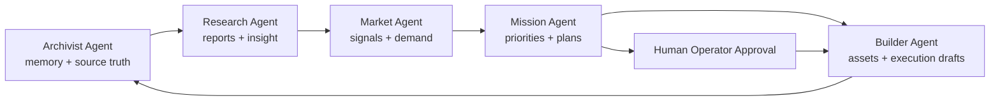

# Archaios Phase II Autonomous Agent Roadmap

Generated: 2026-06-19

## Agent System Goal

Build a practical autonomous agent layer that turns Archaios from a static dashboard into a revenue-producing operating system. The first production agents should be narrow, observable, and tied to customer value: research, market scanning, mission planning, content/product building, and archival memory.

## Shared Agent Contract

Every production agent should follow the same contract:

| Field | Description |
|---|---|
| `agent_id` | Stable machine identifier |
| `purpose` | One-sentence job |
| `inputs` | Data the agent can read |
| `outputs` | Data/artifacts the agent writes |
| `schedule` | Manual, daily, hourly, event-driven |
| `required_tier` | `free`, `pro`, or `elite` |
| `approval_required` | Whether output needs human approval |
| `logs` | Agent run, status, result, error, timestamps |
| `safety_limits` | Scope, rate limits, blocked actions |

Core storage:

- `agents`
- `agent_runs`
- `agent_logs`
- `content_drafts`
- `marketing_queue`
- `intelligence_reports`
- `performance_metrics`
- `mission_plans`
- `research_reports`
- `archival_items`

## Archivist Agent

Purpose:

- Preserve and organize Archaios knowledge, customer activity, agent outputs, documents, briefs, and strategic memory.

Inputs:

- Repository docs.
- `client/docs/`, `docs/`, `reports/`, `roadmaps/`.
- Supabase agent logs and reports.
- Uploaded documents or user notes.
- Historical marketing/content outputs.

Outputs:

- Canonical knowledge index.
- Source summaries.
- Retrieval-ready document chunks.
- Change logs.
- Memory snapshots.
- “What changed since last run” reports.

Required APIs:

- Supabase REST/Postgres.
- Cloudflare Worker storage/API routes.
- Optional vector store or Supabase pgvector.
- Optional GitHub API for repo history.
- OpenAI embeddings and summarization.

Minimum v1:

- Daily scan of docs and agent outputs.
- Store summary records in `archival_items`.
- Produce a weekly “Archaios Memory Brief.”

## Research Agent

Purpose:

- Turn raw topics, customer questions, and market signals into structured intelligence reports.

Inputs:

- User-provided research topics.
- Existing knowledge index.
- Public sources if browsing/research APIs are enabled.
- Internal product data.
- Customer requests and feedback.

Outputs:

- Research reports.
- Opportunity maps.
- Risk notes.
- Source-backed summaries.
- Briefing-ready insights for the Mission Agent.

Required APIs:

- OpenAI text generation.
- Search/news API or curated source API.
- Supabase storage for `research_reports`.
- Optional document parser for PDFs and uploads.

Minimum v1:

- Manual `POST /api/agents/research`.
- Saves report to Supabase.
- Feeds one recommended action into Mission Agent.

## Market Agent

Purpose:

- Detect monetization signals, audience demand, competitor movement, and campaign opportunities.

Inputs:

- Leads.
- CTA clicks.
- Subscription events.
- Dashboard usage events.
- Social/content performance metrics.
- Pricing tier conversion data.

Outputs:

- Market signal summaries.
- Campaign recommendations.
- Offer tests.
- Risk alerts.
- Revenue forecast notes.

Required APIs:

- Supabase analytics tables.
- Stripe subscription/revenue data.
- Optional social platform APIs.
- Optional search/trend APIs.
- OpenAI for analysis.

Minimum v1:

- Daily scan of `leads`, `cta_events`, `subscriptions`, and `revenue_events`.
- Write a `performance_metrics` market snapshot.
- Recommend one campaign and one offer adjustment.

## Mission Agent

Purpose:

- Convert research and market intelligence into prioritized execution plans.

Inputs:

- Research reports.
- Market Agent signals.
- Current revenue goals.
- Open tasks.
- Customer tier/access data.
- Operator constraints.

Outputs:

- Mission plans.
- Ranked task queue.
- Daily command brief.
- Blocker list.
- Owner/agent assignments.

Required APIs:

- Supabase `mission_plans`, `agent_runs`, `agent_logs`.
- Worker task routes.
- Optional GitHub Issues API.
- OpenAI planning model.

Minimum v1:

- Daily plan with 3 critical actions, 3 important actions, and 1 revenue move.
- Human approval before task execution.

## Builder Agent

Purpose:

- Build or prepare customer-facing assets: drafts, landing copy, docs, reports, dashboard improvements, and productized intelligence artifacts.

Inputs:

- Mission plans.
- Research reports.
- Market signals.
- Existing UI/content templates.
- Customer tier requirements.

Outputs:

- Content drafts.
- Landing page copy.
- Product/report drafts.
- Docs pages.
- Implementation tickets.
- Optional code patches after approval.

Required APIs:

- Supabase content tables.
- GitHub API for issues/PRs if enabled.
- OpenAI generation.
- Optional Canva/asset APIs.
- Optional Vercel/GitHub deployment hooks after approval.

Minimum v1:

- Generate and store content/report drafts only.
- Require human approval before publishing or code changes.

## Agent Coordination Model

## Tier Mapping

| Tier | Agent Access |
|---|---|
| Free | Preview summaries, delayed signals, limited Archivist/Research samples |
| Pro | Full Research, Market, Mission briefs, standard Builder drafts |
| Elite | Priority alerts, deeper Research, faster Market scans, advanced Mission planning, premium Builder output |

## Implementation Phases

### Phase 1: Safe Agent Foundation

- Define `agents`, `agent_runs`, `agent_logs` as canonical.
- Add `research_reports`, `mission_plans`, `archival_items`.
- Add one Worker route per agent.
- Require `AUTH_TOKEN` for operator-triggered runs.
- Store every result before displaying it.

### Phase 2: Revenue-Linked Intelligence

- Market Agent reads real leads, CTA clicks, and subscriptions.
- Mission Agent creates daily revenue action plans.
- Builder Agent creates offer/campaign drafts.
- Dashboard displays agent outputs by tier.

### Phase 3: Controlled Autonomy

- Add approval queues.
- Add retry/error handling.
- Add weekly summaries.
- Add customer-specific workspaces.
- Add billing-aware usage limits.

### Phase 4: Scale

- Add team accounts.
- Add external integrations.
- Add richer retrieval/memory.
- Add enterprise workflows.
- Add service-level monitoring.

## Safety Boundaries

- No autonomous billing changes.
- No publishing without approval until explicit production policy is approved.
- No service role keys in client code.
- No destructive database operations from agents.
- No broad web crawling without source allowlists.
- All paid-user output must include traceable source/run metadata.
